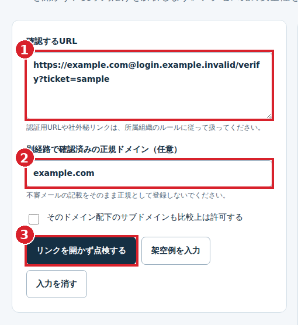

# 守りの道具箱｜無料ダウンロード

**AI業務改善ラボ／白鳥 裕児**の、5種類のセキュリティ点検ツール集です。

**個人・法人とも無料。登録不要。本体・結果の表示・保存・基本手順・公開する修正版に料金はかかりません。** カード情報、APIキー、有料教材の購入、広告閲覧は必要ありません。

## まず確認してください

現在は **0.1.2-preview（公開検証版）** です。安定版や企業向け認証を取得した製品ではありません。**ウイルス対策・侵入検知・常時監視・攻撃の自動遮断は行いません。** 既存のウイルス対策を置き換えないでください。

会社の端末は情報システム部門の承認が必要です。**Windows設定収集スクリプトは実機未検証・未署名です。一般利用者は実行せず、管理者によるソース確認と承認済み環境の試験を先に行ってください。** 通常のブラウザー点検とWindowsの架空結果表示にはスクリプトは不要です。

## 無料ツールと赤枠付き手順書

### [最新版ZIPをダウンロード（本体＋画像手順書＋サンプル／約2 MB）](https://raw.githubusercontent.com/hakutyonn/Upload-files/main/mamori-toolbox/v0.1.2-preview/mamori-toolbox-0.1.2-preview.zip)

### [赤枠付き操作手順書を先に開く（PDF・13ページ）](https://github.com/hakutyonn/Upload-files/blob/main/mamori-toolbox/v0.1.2-preview/USER_GUIDE.pdf)

[ZIPのファイル画面](https://github.com/hakutyonn/Upload-files/blob/main/mamori-toolbox/v0.1.2-preview/mamori-toolbox-0.1.2-preview.zip) ／ [更新履歴](https://github.com/hakutyonn/Upload-files/blob/main/mamori-toolbox/v0.1.2-preview/CHANGELOG.txt) ／ [更新手順](https://github.com/hakutyonn/Upload-files/blob/main/mamori-toolbox/v0.1.2-preview/UPDATE_GUIDE.txt)

GitHubアカウントの登録は不要です。企業ネットワークでGitHubへのアクセスが制限される場合は管理者に確認し、制限を回避しないでください。

## 3ステップで始める

**1. ZIPを保存・すべて展開 → 2. `MamoriToolbox/START.html`を開く → 3. 架空例で試して結果を保存**

画面上部の「手順書を開く」から、実画面・赤枠・番号で説明する手順書を別タブで開けます。入力は自動保存されません。後日続ける入口台帳はJSONで保存してください。



画像はツールを実際に動かして撮影したものです。生成AIで作った架空の操作画面ではありません。画像内の入力例は架空です。

## 5つの点検

| 機能 | できること | できないこと |
|---|---|---|
| 入口・認証点検 | VPN・クラウド等の申告情報を台帳にし、改善候補を整理 | ネットワーク走査・自動修正 |
| Windows点検 | 架空結果や管理者が承認・取得したJSONを表示 | 感染判定・全アプリの脆弱性診断 |
| 不審URL点検 | リンクを開かず、ホスト名・紛らわしい表記を確認 | リンク先・転送先の確認、安全証明 |
| AI送信前点検 | 一部の機密情報候補と指定語句を検出し、伏せ字案を作成 | 完全匿名化・外部送信許可の判断 |
| 復旧の備え点検 | バックアップの備え、目標と実測の差、2ファイルのSHA-256照合 | バックアップ作成・復元・非感染証明 |

通常のブラウザー操作にアプリの追加インストール、Python、Node.js、支払いは不要です。提供者が毎回同席する形式ではありませんが、利用者の確認や管理者の判断は必要です。

## 0.1.2で修正・追加したこと

長い認証情報の末尾が残る問題とJSON形式の取りこぼしを修正し、決済APIキー・Bearer形式の候補検出を追加しました。旧版のAI送信前点検を使用している場合は更新し、出力の全文確認を続けてください。**新版でも検出の完全性を保証しません。** 認証情報を外部送信済みなら、伏せ字の作成だけで済ませず、管理者の手順で失効・再発行を検討してください。

Windows結果の架空データ区分を必須にし、スクリプト取得前の管理者確認欄を追加しました。全5機能の赤枠付き手順書をHTML・PDFにまとめ、更新案内を同梱しました。

## 確認した範囲と残る制限

公開用のビルドで、入力・保存・表示・画像手順書など48項目と、認証情報・架空データ区分の回帰テスト7群に成功しました。GitHub ActionsのLinux上のChromiumでは、HTMLの直接起動と、ブラウザー本来のWeb Cryptoによる同一内容の2ファイル照合も確認しました。**これはWindows設定収集、Windows／Mac／iPhoneの実端末、実企業環境の検証ではありません。**

公開後は認証情報を使わずにZIP・手順書などを取得し、公開前ファイルとのハッシュ一致を確認しています。テスト件数を侵入テストや企業認証の件数として合算しません。

Windows実機試験、電子署名、第三者コード・脆弱性レビュー、ウイルススキャンは未完了です。警告や組織の保護設定を解除しないでください。[詳細な確認記録](https://github.com/hakutyonn/Upload-files/blob/main/mamori-toolbox/v0.1.2-preview/REVIEW.json)

## 更新とデータの扱い

更新は無料の**手動ダウンロード方式**です。画面の「最新版・更新情報」で確認し、必要なデータを保存してから新版を別フォルダーへ展開します。自動更新・個別メール通知・利用者の更新完了確認はありません。無期限更新・24時間対応・一定時間内の修正は約束していません。

本体に自動外部送信、外部AI、広告、解析、会員登録、Cookie・localStorageによる自動保存はありません。人が公式資料や更新リンクを開く操作、GitHubから取得する操作は外部通信です。保存・コピー先、端末同期、拡張機能、端末自体の感染までは管理しません。

**個別相談・個別サポート・導入代行は含まれません。** 無料利用・社内配布は可能です。セキュリティ以外の有料事業と分離し、危険の指摘や基本手順を課金解除の条件にしません。法令上制限できない権利を排除する趣旨ではありません。

個人情報、社内点検結果、認証情報、非公開の脆弱性詳細を公開Issueに書かないでください。被害が疑われる端末では新しいツールの試用より、所属先のインシデント対応手順を優先してください。

## ファイルの一致確認

`mamori-toolbox-0.1.2-preview.zip`：2,064,855 bytes

SHA-256：

```
2baa8bd3770742b9bad519edcf738f3cf1275b88e1932ec0a551348cb5dc4135
```

同じ配布元のハッシュは一致確認用です。真正性・無害性や電子署名の代替ではありません。

更新日：2026年10月9日。AI業務改善ラボ本体へのメニュー・リンク追加は未反映です。このGitHubページが現在の無料配布先です。
